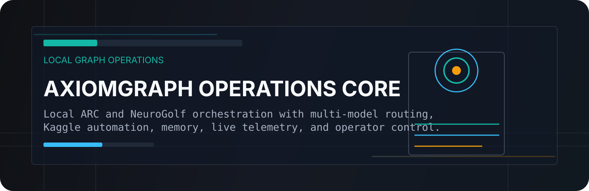
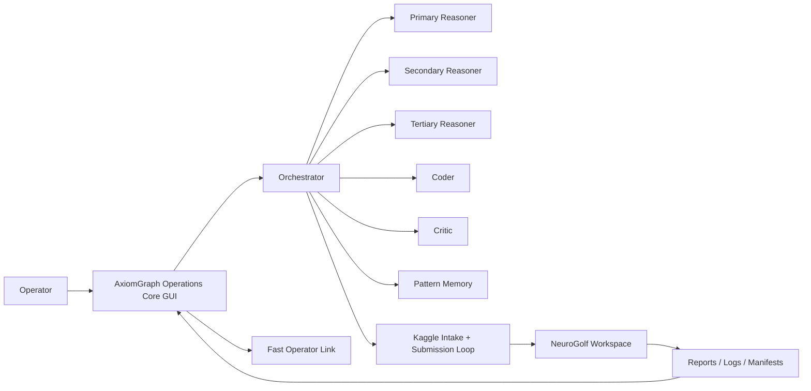

# AxiomGraph Operations Core

<p align="center">
  
</p>

<p align="center">
  <strong>Local-first ARC and NeuroGolf orchestration with Ollama, Kaggle automation, and a professional operations console.</strong>
</p>

<p align="center">
  
  
  
  
</p>

<p align="center">
  <a href="https://github.com/hyper10203/Skynet-Control-Core/actions/workflows/ci.yml">
    
  </a>
</p>

## What This Is

AxiomGraph Operations Core is a local AI operations stack for:

- ARC-style symbolic reasoning
- NeuroGolf submission optimization
- multi-model orchestration through Ollama
- Kaggle source intake and score-aware submission workflows
- live monitoring through a Streamlit GUI

You talk to one front-door system. It decides when to keep work local and when to wake specialist models.

## Why It Exists

Most local agent stacks either feel like a toy chatbot or a loose pile of scripts.

This repo is built to be a proper control surface:

- one orchestrator lane for high-level decisions
- one lightweight fast operator lane for quick questions
- three reasoning lanes for disagreement and synthesis
- one coder lane for implementation
- one critic lane for attack and failure analysis
- a persistent memory layer
- a daemon that can keep working while you step away

## Core Features

- Stylish Streamlit dashboard with live daemon status, rank, scores, logs, reports, and ARC visualization
- Autonomous NeuroGolf loop with seed-preserving pack strategies and Kaggle-aware submission gating
- Kaggle intake box that can pull notebooks and datasets directly from pasted links or CLI snippets
- Model-role editor with profile loading, installed-model detection, and context auto-fill
- Direct orchestrator chat plus a separate fast operator chat lane
- `.env`-backed runtime settings so loop timing and submission controls stay stable across restarts

## System Layout



## Model Team

| Role | Purpose |
|---|---|
| `orchestrator` | Main planner and synthesis layer |
| `operator_fast` | Lightweight operator-facing chat and control helper |
| `reasoning_primary` | Careful symbolic strategist |
| `reasoning_secondary` | Alternative hypothesis generator |
| `reasoning_tertiary` | Overlooked-leverage and resource-fusion strategist |
| `coder` | Implementation specialist |
| `critic` | Counterexample and risk hunter |

## Repository Highlights

- [dashboard.py](dashboard.py): main Streamlit control center
- [autonomous_neurogolf.py](autonomous_neurogolf.py): 24/7 NeuroGolf daemon logic
- [core/](core): orchestration, config, prompts, env handling, runtime control
- [agents/](agents): role-specific agent wrappers
- [CONTROL_CENTER_README.md](CONTROL_CENTER_README.md): full button-by-button GUI guide
- [data/training](data/training): ARC task payloads used by the local stack

## Quick Start

1. Install dependencies with `bootstrap.ps1`
2. Make sure Ollama is running
3. Run `healthcheck.py`
4. Start the dashboard
5. Use the GUI to load roles, control the daemon, and inspect NeuroGolf cycles

Main launcher scripts:

- [bootstrap.ps1](bootstrap.ps1)
- [start_dashboard.ps1](start_dashboard.ps1)
- [stop_dashboard.ps1](stop_dashboard.ps1)
- [run_autonomous_neurogolf.ps1](run_autonomous_neurogolf.ps1)
- [start_autonomous_neurogolf.ps1](start_autonomous_neurogolf.ps1)
- [stop_autonomous_neurogolf.ps1](stop_autonomous_neurogolf.ps1)

## Deployment

This project is deployable, but it is best treated as a **self-hosted AI operations system**, not a generic stateless web app.

Included deployment assets:

- [Dockerfile](Dockerfile)
- [docker-compose.yml](docker-compose.yml)
- [.streamlit/config.toml](.streamlit/config.toml)
- [DEPLOYMENT.md](DEPLOYMENT.md)
- [.github/workflows/ci.yml](.github/workflows/ci.yml)

Best-fit deployment path:

- run the dashboard in Docker
- keep Ollama running on the host or on a reachable model server
- mount a writable NeuroGolf workspace into the container
- access it over LAN or through Tailscale from any device while your laptop stays on

Fast start:

```bash
cp .env.example .env
docker compose up --build -d
```

Then open `http://localhost:8501`.

For remote control from other devices:

- on the same network, use the LAN URL shown in the dashboard
- across the internet, use Tailscale and open the Tailscale URL shown in the dashboard
- keep `SKYNET_UI_PASSWORD` set in `.env`

## Dashboard Surface

The control center includes:

- live daemon and telemetry overview
- operations controls for starting, stopping, syncing, and running cycles
- model profile management
- NeuroGolf leaderboard and submission state
- ARC visualizer
- report inspection
- direct chat with the orchestrator or fast operator link

See [CONTROL_CENTER_README.md](CONTROL_CENTER_README.md) for the full guide.

## NeuroGolf Automation Notes

The NeuroGolf side is intentionally conservative:

- preserve strong accepted public seeds where possible
- treat Kaggle score as final truth
- avoid trusting local scorer deltas too much
- keep `task000` unless there is strong evidence to remove it
- prefer controlled swaps over full rebuilds

## Deployment Notes

This repo is set up to be GitHub-safe:

- `.env` is not committed
- live daemon logs and local runtime state are ignored
- the tracked codebase includes `.env.example` for setup

If you deploy this elsewhere, copy `.env.example` to `.env` and adjust model and path settings for the target machine.

## Project Philosophy

This is not trying to be a generic chatbot.

It is a working local operations system for ARC and NeuroGolf:

- hypothesis-driven
- score-aware
- tool-using
- memory-backed
- operator-steerable

If your goal is to leave the machine running and let a coordinated local model team keep pushing the competition forward, this repo is built for that.
